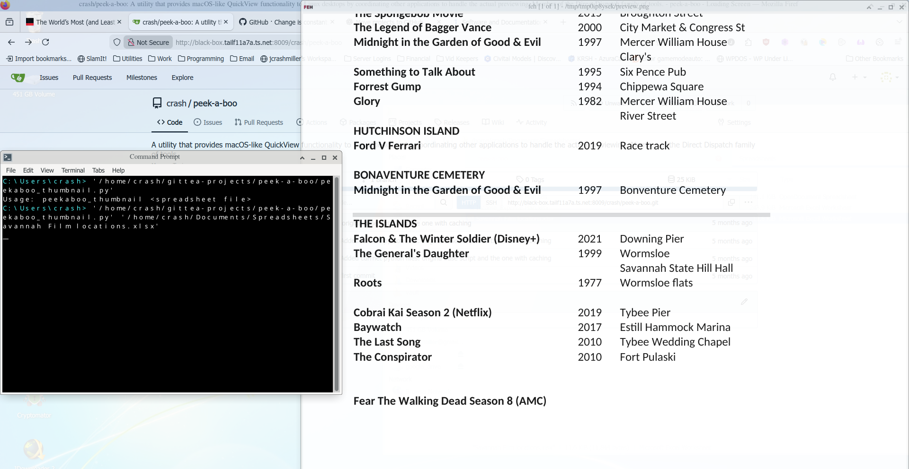

# Peek-A-Boo

Quickly preview any supported file in Linux without opening its main app for editing.

## In Development

## Requirements
- feh
- libreoffice

## Screenshots

## Quick Start

1. Install dependencies: `./scripts/install_dependencies.sh`
2. Run: `python3 peekaboo_thumbnail_with_cache.py`
3. Register keyboard shortcut to call script with highlighted file as argument.

## Features

- Caching - Any file previewed within the past 30 minutes will show near instantly.
- Fast - Generates preview of part of the file rather than the whole thing.

## Supported File Types

- Spreadsheets

## To Do

- Add support for further file types
    - Audio
    - Video
    - Images
    - Documents
    - Presentations
- Add helper script to set up file browser and keyboard shortcut integration
